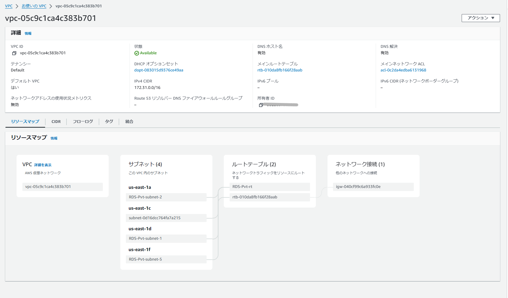
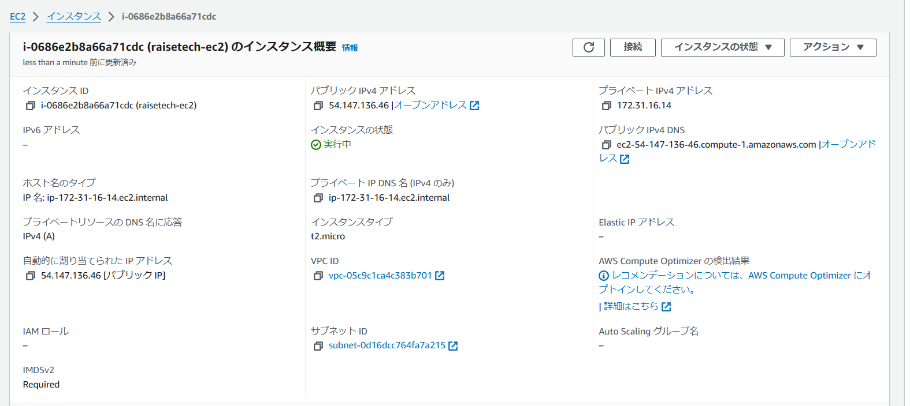
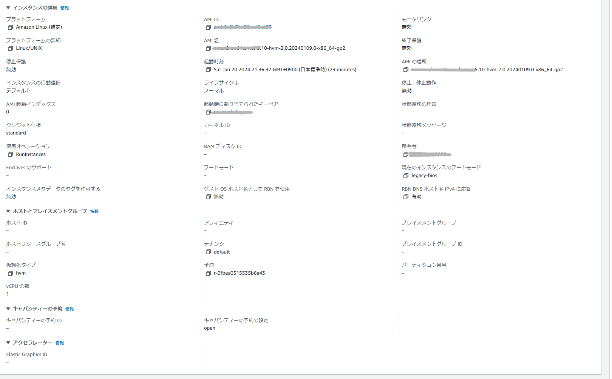
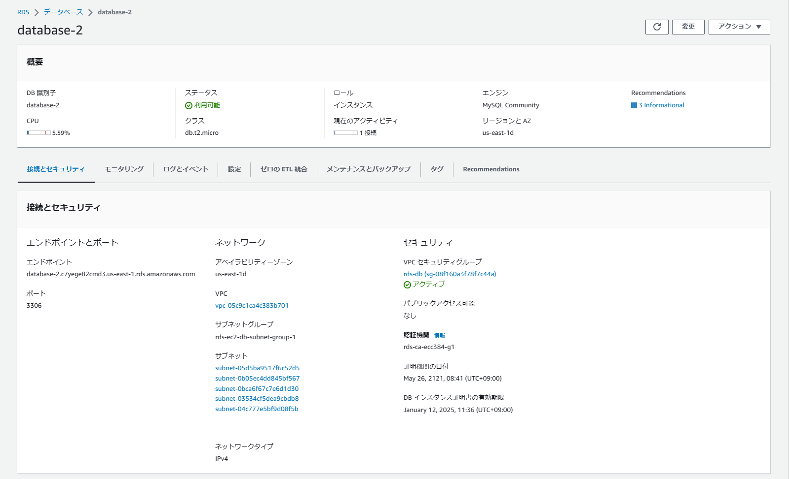
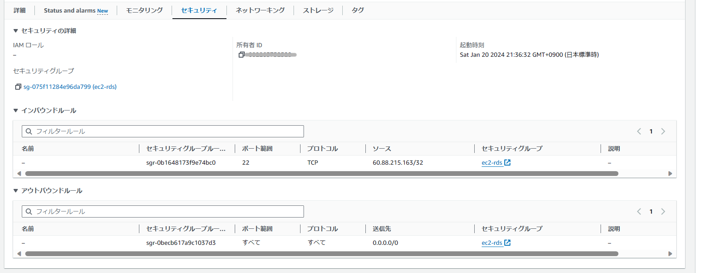
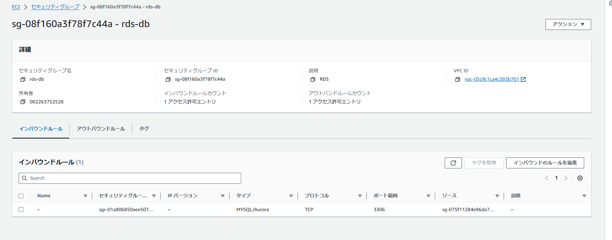
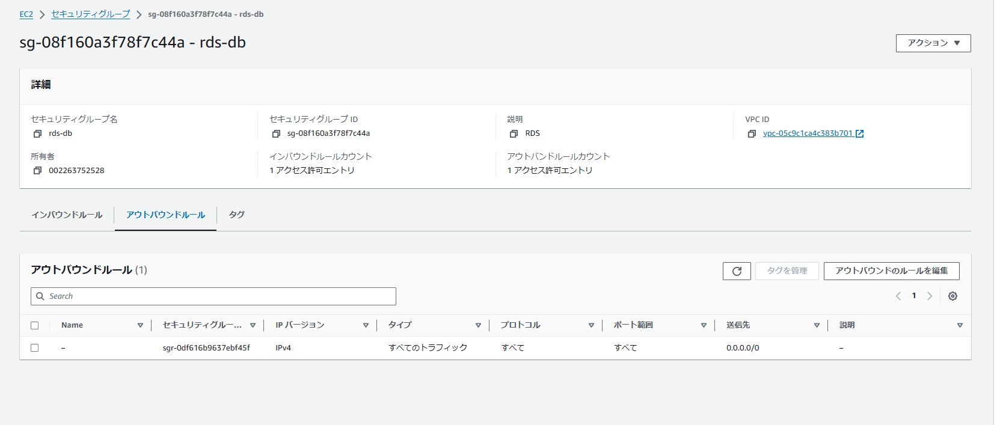
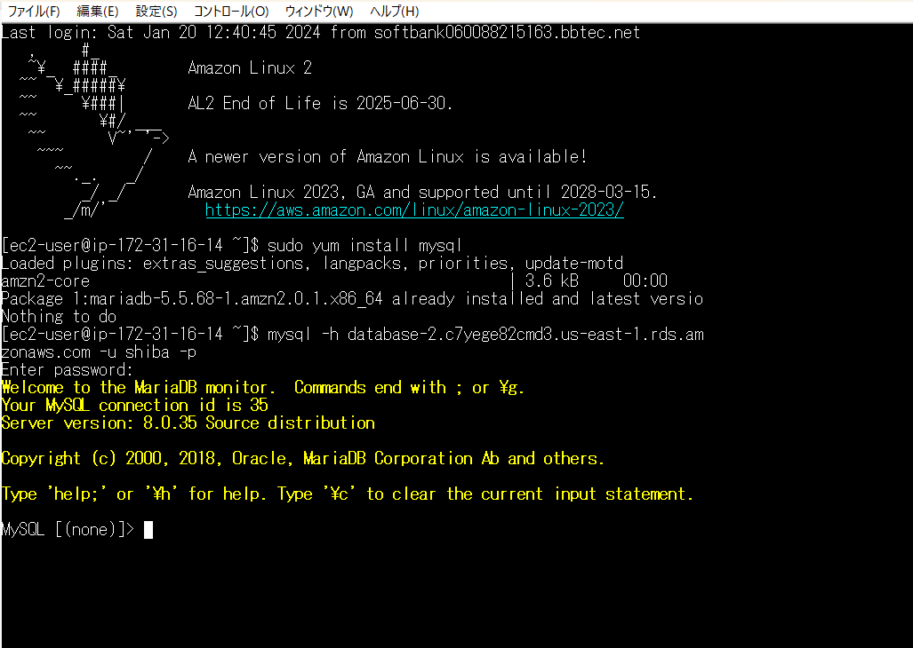

## VPCの作成

## EC2

## RDS

## セキュリティ設定
### EC2
　　
sshに接続できるようにポート範囲を22に設定。　　

### RDS

EC2からRDSへ接続できるようにインバウンドはEC2のセキュリティグループを設定。　　

EC2、RDSのアウトバウンドは全て許可に設定。
## EC2からRDSへ接続

teratermを利用。　　

ログイン時はファイルに保存したキーペアを使う。　　

`sudo yum install mysql`でMySQLをインストール。　　

`mysql -h (RDSのエンドポイント）-u (マスターユーザー名) -p (マスターパスワード)`を入力し、接続できることを確認。　　  

## 感想
EC2からRDSへの接続ができず、苦戦したおかげでだんだんとセキュリティ設定と接続のイメージが出来るようになった。　　
とはいえ完全な理解は難しく、ここはもう少し時間をかけて勉強したい。   

コマンドミスや設定の見落としがあり、ひとつひとつ検証していく必要がある。
