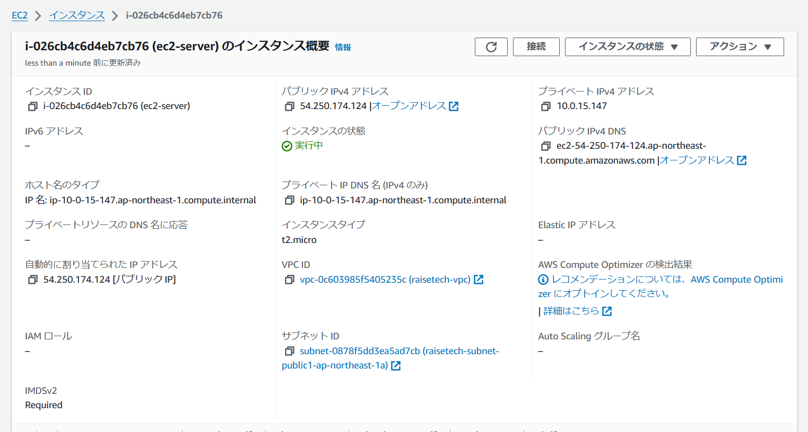
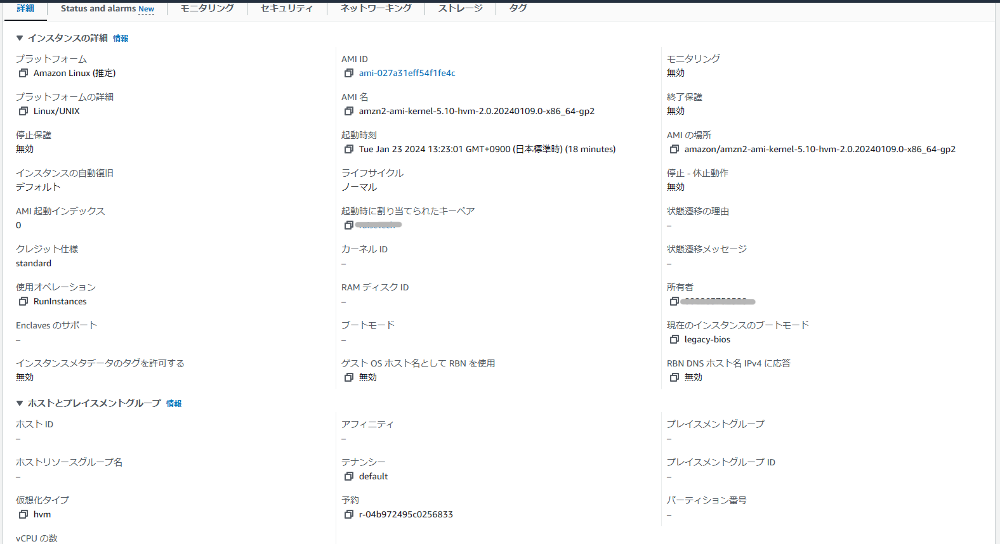
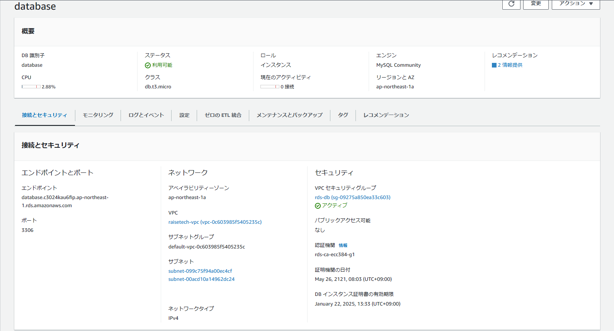
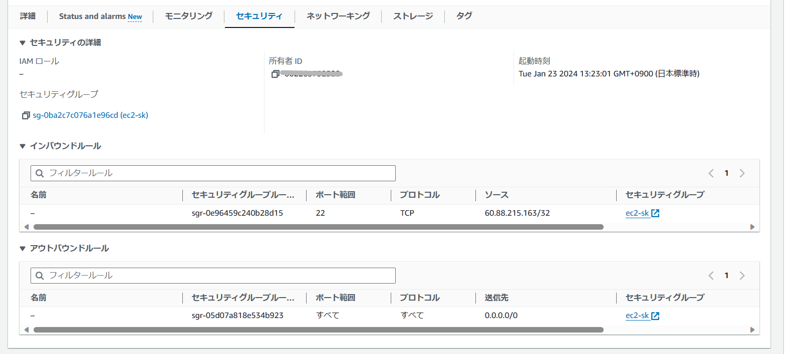
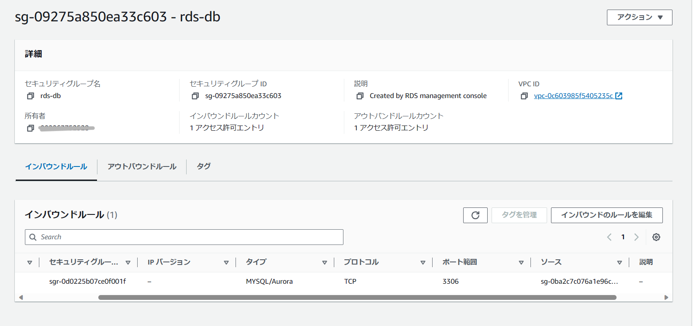
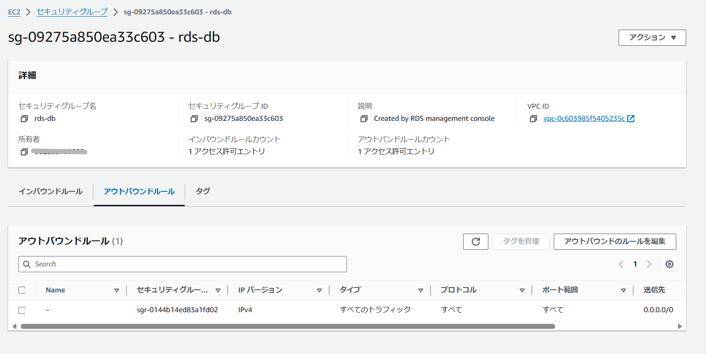
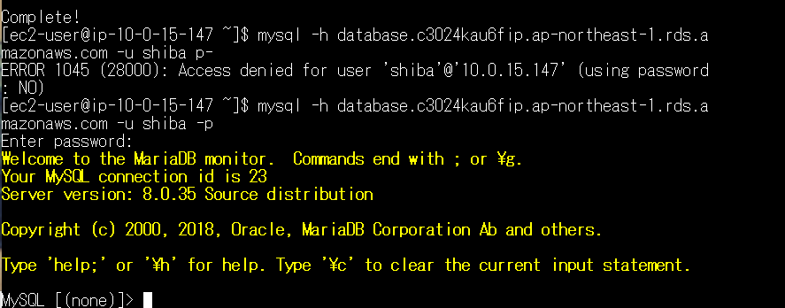

リージョンがバージニア北部になっていたので東京に変更し、VPC、EC2、RDSを再構築しました。

## VPCの作成  
　　

## 変更後　　
  

アベイラビリティゾーンにそれぞれプライベートとパブリックのサブネットを作成。

## EC2

  

## 変更後　

  
　　
EC2を新しく作成。
## RDS
  

## 変更後　

  

サブネットをプライベートに変更。

## セキュリティ設定
### EC2
　　

### 変更後

### RDS

　

### 変更後

## EC2からRDSへ接続
  
teratermを利用。　　

ログイン時はファイルに保存したキーペアを使う。　　
`sudo yum install mysql`でMySQLをインストール。　　

`mysql -h (RDSのエンドポイント）-u (マスターユーザー名) -p (マスターパスワード)`を入力し、接続できることを確認。　　  

再構築後も接続できることを確認。

## 感想
アベイラビリティゾーンについてあまり理解していなかったので、サブネットがバラバラな状態になっていた。　　

まだまだ確信を持って実行できていない部分があるので、ひとつずつ検証しながら慣れていきたい。

